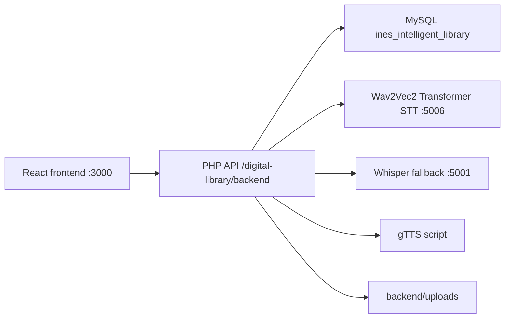

# INES Digital Library System Architecture

Updated: 2026-06-10

## Runtime layers

```text
frontend/      React 18 + Vite user interface
backend/       PHP API, auth, roles, prepared SQL, uploads, AI orchestration
database/      MySQL schema, seeds, migrations, query reference
scripts/       AI services, gTTS, document conversion, checks, acceptance tests
models/stt/    STT metric reports
speech_datasets/ LibriSpeech manifests and local real audio cache
book_imports/  Legal book metadata and import scripts
```

## Request flow

React calls the PHP backend. PHP connects to MySQL and calls internal Python
services. MySQL is never called directly from React.



## Speech-to-text

Active path:

1. React records microphone audio with `MediaRecorder`.
2. React posts audio to `/voice-search/search`.
3. PHP calls `http://127.0.0.1:5006/api/stt/transcribe`.
4. If Transformer STT fails, PHP calls `http://127.0.0.1:5001/transcribe`.
5. PHP logs the request in `voice_search_logs` and searches the catalog.

The current model is the local `transformer_model/` checkpoint, initialized
from pretrained `facebook/wav2vec2-base-960h` Wav2Vec2 Transformer CTC weights
and fine-tuned on real LibriSpeech manifest samples.

## Text-to-speech

Reader pages request narration through PHP. PHP invokes
`scripts/gtts_synthesize.py`, which uses the `gtts` package to generate an MP3.
The resulting audio is stored under backend uploads and logged in `tts_logs`.

## Book storage

Catalog metadata lives in MySQL. Book files are stored under
`backend/uploads/books/{book_id}/`. Private uploads are stored under
`backend/uploads/personal_books/`. Import source files under
`book_imports/books/` are ignored by Git because they are large downloaded
runtime assets.

## Tracking

Tracking tables include `reading_progress`, `search_logs`, `voice_search_logs`,
`tts_logs`, `activity_logs`, `security_logs`, and `login_logs`.

## Removed legacy pieces

The previous LSTM/RNN experiments were removed from the active project:

- LSTM training scripts;
- LSTM inference services on ports `5004` and `5005`;
- LSTM checkpoints and metrics;
- stale LSTM methodology and status documents.

The retained STT training direction is Transformer fine-tuning with
`scripts/transformer_train_complete.py`.
