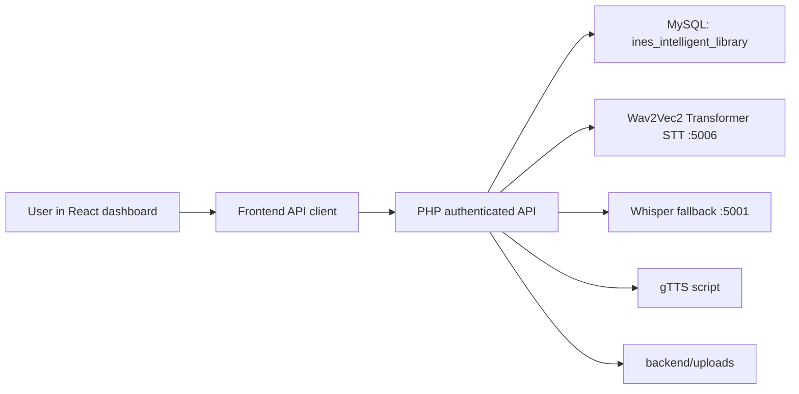
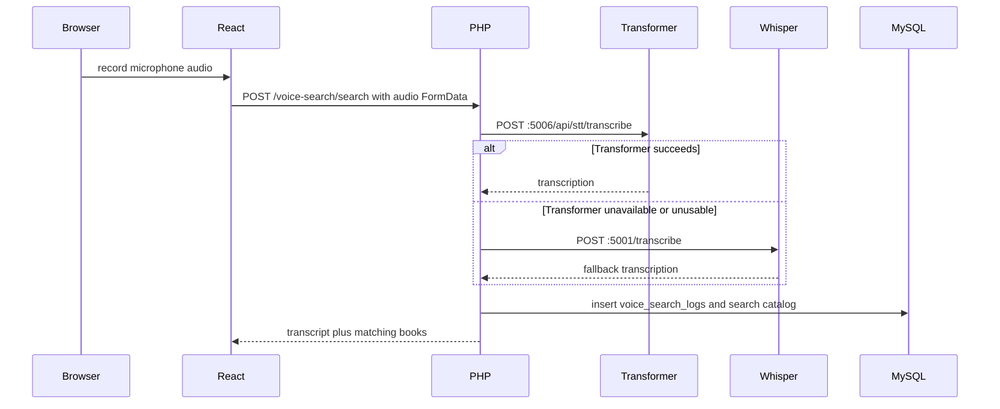

# INES Digital Library Logic and Transformer STT Methodology

Updated: 2026-06-10

## What the system uses

- Frontend: React 18 with Vite in `frontend/`.
- Public backend: PHP 8.2 on XAMPP in `backend/`.
- Database: MySQL database `ines_intelligent_library`.
- AI services: Python services launched from `scripts/start_ai_services.ps1`.
- Text-to-speech: Google gTTS through `scripts/gtts_synthesize.py`.
- Speech-to-text: Wav2Vec2 Transformer CTC on port `5006`, with Whisper `tiny.en` fallback on port `5001`.

The old RNN/LSTM services, LSTM checkpoints, LSTM metrics, and LSTM guide files
were removed from the active project. The application no longer routes
microphone search through LSTM or RNN services.

## System workflow



React never connects directly to MySQL. It sends authenticated HTTP requests to
the PHP API. PHP validates roles, uses prepared SQL, logs activity, calls AI
services when needed, and stores/loads files from the upload directories.

## Frontend to backend connection

The frontend API helpers are in `frontend/src/api/`. The shared request helper
adds the API base URL and authentication token. Microphone search uses:

1. `frontend/src/pages/library/SearchBooks.jsx` or the dashboard global search.
2. `frontend/src/api/voiceSearch.js`.
3. `POST /voice-search/search` on the PHP backend.
4. `backend/routes/api.php`.

The browser records a short `webm` audio blob using `MediaRecorder`, sends it as
`FormData`, then receives the transcription and matching catalog results.

## Database connection

PHP connects to MySQL through `backend/config/database.php` and
`backend/helpers/Database.php`. The active database is
`ines_intelligent_library`. SQL files live under `database/`.

Important table groups:

- authentication and roles: `users`, `roles`, `user_profiles`, `password_resets`, `login_logs`;
- academics: `faculties`, `departments`, `courses`, `lecturer_courses`;
- catalog: `authors`, `categories`, `books`, `book_files`, `book_courses`;
- circulation: `borrow_requests`, `borrowing_history`;
- reading: `reading_progress`, `favorites`, `bookmarks`, `ratings`, `reviews`;
- recommendations and lists: `recommendations`, `reading_lists`, `reading_list_books`, `lecture_notes`;
- logs and AI tracking: `notifications`, `activity_logs`, `security_logs`, `search_logs`, `voice_search_logs`, `tts_logs`, `ai_error_logs`;
- settings: `system_settings`.

## Books and files

Library books are stored in MySQL metadata tables and copied to
`backend/uploads/books/{book_id}/`. Private user uploads are stored under
`backend/uploads/personal_books/`. Word files are converted to PDF during upload
by the backend document pipeline when the required local tools are available.

The legal import batch is prepared in `book_imports/`. The downloaded PDFs and
texts are intentionally ignored by Git under `book_imports/books/` because they
are large runtime/import data, not source code.

## Tracking system

The tracking system is database-backed:

- `reading_progress` stores reader location and percentage.
- `search_logs` stores typed searches.
- `voice_search_logs` stores microphone transcriptions and matched search text.
- `tts_logs` stores narration requests.
- `activity_logs`, `security_logs`, and `login_logs` store user and security events.

Frontend pages call the PHP API; PHP updates these tables using prepared SQL.

## gTTS text-to-speech connection

Reader pages call the PHP narration endpoint in `backend/routes/api.php`. PHP
extracts or receives English text, validates length/language, and invokes:

```powershell
python scripts/gtts_synthesize.py --text "<english text>" --output "<mp3 path>" --lang en
```

The script imports `gTTS` from the `gtts` package and writes an MP3. PHP stores
the file reference, logs the request in `tts_logs`, and returns the audio URL to
React. The frontend plays the MP3 in the reader.

## Current speech-to-text model

The active STT service is `scripts/transformer_speech_service.py`.

- Architecture: Wav2Vec2 Transformer encoder with a CTC output head.
- Default weights: `facebook/wav2vec2-base-960h`.
- Runtime port: `http://127.0.0.1:5006`.
- Endpoint: `POST /api/stt/transcribe` or `POST /transcribe`.
- Fallback: Whisper `tiny.en` on `http://127.0.0.1:5001/transcribe`.

The service first looks for a local fine-tuned checkpoint in
`transformer_model/` or `transformer_librispeech_model/`. If no `config.json`
exists there, it loads the pretrained Hugging Face model directly. At this
moment the connected production service is `transformer_model/`, a local
checkpoint fine-tuned from `facebook/wav2vec2-base-960h`.

## Dataset and loading method

The real speech dataset is LibriSpeech. Local manifests are stored in:

- `speech_datasets/manifests/train.jsonl`
- `speech_datasets/manifests/dev.jsonl`
- `speech_datasets/manifests/test.jsonl`

Each manifest row contains:

- `audio_filepath`: path to a real LibriSpeech FLAC file;
- `text`: human transcript;
- `dataset`: `LibriSpeech`;
- `source_split`: original LibriSpeech split.

The validated manifest summary is:

- train: 28,539 samples, about 100.591 hours;
- dev: 2,703 samples, about 5.388 hours;
- test: 2,620 samples, about 5.403 hours.

For inference, browser audio is normalized to mono 16 kHz WAV using `ffmpeg`
or `librosa`. The Wav2Vec2 processor converts waveform samples into model
inputs. The model returns token logits, the service applies argmax CTC decoding,
and the processor decodes IDs into English text.

## Training status and epochs

Current connected Transformer local fine-tuning: `1` CPU-bounded pass over the
selected training subset, `8` optimizer steps, head-only tuning.

The checkpoint starts from pretrained Wav2Vec2 weights. The pretrained base
model was originally trained outside this project on LibriSpeech 960 hours.
The local project training then used real LibriSpeech manifest samples and
saved the promoted checkpoint to `transformer_model/`.

Future fine-tuning methodology:

1. Load train/dev/test JSONL manifests.
2. Read real FLAC audio and transcript pairs.
3. Resample to 16 kHz mono.
4. Tokenize transcripts with the Wav2Vec2 CTC tokenizer.
5. Fine-tune `Wav2Vec2ForCTC` using CTC loss.
6. Evaluate on untouched dev/test samples.
7. Save the final checkpoint to `transformer_model/`.
8. Save final metrics to `models/stt/transformer_metrics.json`.

## Accuracy and metrics

Current local metric file: `models/stt/transformer_metrics.json`.

Latest real LibriSpeech run:

- train samples: 48 from `train-clean-100`;
- optimizer steps: 8;
- train mode: Wav2Vec2 encoder frozen, CTC projection head trainable;
- dev evaluation: 12 `dev-clean` clips, 84.39% word accuracy, 41.67% exact sentence accuracy;
- test evaluation: 20 `test-clean` clips, 94.25% word accuracy, 60.00% exact sentence accuracy;
- aggregate word accuracy: 89.32%;
- aggregate exact sentence accuracy: 50.83%;
- aggregate WER: 10.68%.

This is a real-data CPU-bounded fine-tune, not a full 100-hour LibriSpeech
training run. Full fine-tuning of the complete dataset needs much more time or
a CUDA GPU.

The previous 96.29% word accuracy / 69.17% exact sentence accuracy belonged to
the retired Wav2Vec2 + BiLSTM adapter. It is not the active production
Transformer metric.

Metric formulas:

- Word Error Rate: `(Substitutions + Insertions + Deletions) / Reference Words`.
- Word Accuracy: `max(0, 1 - WER) * 100`.
- Character Error Rate: `(Character Substitutions + Insertions + Deletions) / Reference Characters`.
- Exact Sentence Accuracy: `Correct Full Sentences / Total Sentences * 100`.
- Word Precision: `Correct Predicted Words / All Predicted Words`.
- Word Recall: `Correct Predicted Words / All Reference Words`.
- Word F1: `2 * Precision * Recall / (Precision + Recall)`.
- Token-presence ROC-AUC: one-vs-rest ROC-AUC over CTC vocabulary-token
  presence in the transcript using each token's maximum predicted probability
  across audio frames.

ROC-AUC is included because it was requested for supervision. WER, CER, sentence
exact accuracy, and word F1 remain the primary speech-to-text metrics because
they measure final transcription quality directly.

## Backend and frontend STT connection



The student dashboard and catalog search use this same route, so microphone
searches are connected to the Transformer service through the backend, not by
calling Python directly from the browser.
