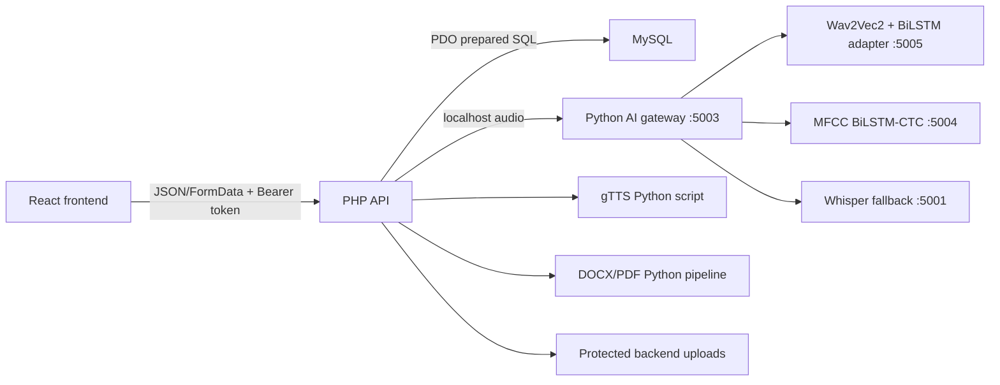

# Project Logic, Function Reference, and English STT Methodology

Date: 2026-06-09

## 1. System workflow

The browser never receives database credentials and never calls an AI model
directly. PHP remains the public security boundary.

## 2. Frontend

Location: `frontend/src`

Technology:

- React renders the application.
- React Router selects public and role-protected pages.
- Vite serves development files and creates `dist/`.
- Browser `SpeechRecognition` is used where available.
- Browser `MediaRecorder` sends microphone audio to PHP when server STT is
  needed.

Important modules and functions:

- `main.jsx`: mounts React, Router, and `AuthProvider`.
- `App.jsx`: declares every public, student, lecturer, and librarian route.
- `context/AuthContext.jsx`: login state, token restoration, logout, and role
  dashboard selection.
- `routes/ProtectedRoute.jsx`: rejects unauthenticated or unauthorized routes.
- `layouts/AppLayout.jsx`: dashboard shell, navigation, global search, and
  microphone entry.
- `api/client.js`: base URL, Bearer header, JSON/FormData handling, and API
  error normalization.
- `api/auth.js`: register, login, profile, password reset, and logout calls.
- `api/books.js`: catalog CRUD, file metadata, content, and download URLs.
- `api/search.js`: typed catalog search.
- `api/voiceSearch.js`: microphone uploads and open-vocabulary catalog searches.
- `api/tts.js`: narration request and protected audio URL.
- remaining `api/*.js`: one focused API wrapper for its feature table/page.

Pages call API wrappers, API wrappers call `client.js`, and `client.js` calls:

`http://localhost/digital-library/backend`

## 3. PHP backend

Location: `backend`

Entry flow:

1. `index.php` loads environment variables.
2. `config/cors.php` permits the configured frontend origins.
3. helpers load request, response, validation, and PDO behavior.
4. middleware identifies the token owner and checks roles.
5. `routes/api.php` executes the requested feature.

Core functions:

- `Database::connection()`: one PDO connection using `utf8mb4`, exceptions,
  associative rows, and native prepared statements.
- `Request::input()`: parses JSON/form request data.
- `Request::bearerToken()`: reads the authorization token.
- `Response::ok()` / `Response::error()`: consistent JSON responses.
- `Validator::require()`, `email()`, `int()`: rejects invalid input.
- `current_user()`: loads the active session and role.
- `require_role()`: enforces student, lecturer, or librarian permissions.
- `ActivityLogService::log()`: writes general audit events.
- `service_upload_audio()`: sends an uploaded file only to localhost Python.
- `process_uploaded_library_file()`: validates, stores, and converts uploads.
- `stream_file_response()`: permission-checked inline/download streaming.
- `generate_gtts_audio()`: English gTTS generation and cache.
- `parse_catalog_query()`: extracts search keywords, author, and availability.
- `interpret_library_action()`: maps open-vocabulary phrases to safe routes.

All user-controlled SQL values use prepared statements. Transactions and row
locks protect borrowing and moderation state changes.

## 4. Python backend

`backend/python/main.py` is an internal FastAPI gateway.

Functions:

- `service_health()`: checks a localhost model service.
- `read_last_json_line()`: reads the latest training event.
- `health()`: returns the state of all AI services.
- `models()`: describes active STT/TTS providers.
- `training_status()`: reports the current research checkpoint and progress.
- `transcribe()`: attempts custom LSTM models, applies the quality gate, and
  falls back to Whisper.

Python does not access MySQL. This intentionally leaves authentication,
permissions, and audit logging in PHP.

## 5. Database connection and components

PHP reads `backend/config/database.php` and connects through PDO to:

`ines_intelligent_library`

The live schema has 35 tables, 350 columns, and 62 foreign keys.

Groups:

- identity: `roles`, `users`, `user_profiles`, `password_resets`,
  `login_logs`, `security_logs`;
- academic: `faculties`, `departments`, `courses`, `lecturer_courses`;
- catalog: `authors`, `categories`, `books`, `book_files`, `book_courses`;
- uploads: `book_submissions`, `personal_books`, `lecture_notes`;
- reading: `borrow_requests`, `borrowing_history`, `reading_progress`,
  `favorites`, `bookmarks`, `reading_lists`, `reading_list_books`;
- engagement: `ratings`, `reviews`, `recommendations`, `notifications`;
- tracking: `activity_logs`, `search_logs`, `voice_search_logs`, `tts_logs`,
  `ai_error_logs`;
- configuration: `system_settings`.

Schema and seed files are under `database/`.

## 6. Books and files

Metadata is stored in MySQL. File bytes are stored under:

- catalog: `backend/uploads/books/<book-id>/`;
- private books: `backend/uploads/personal-books/<user-id>/`;
- student submissions: `backend/uploads/submissions/<user-id>/`;
- lecture notes: `backend/uploads/lecture-notes/`;
- generated MP3: `backend/uploads/tts/<user-id>/`.

Downloads pass through PHP ownership/role checks. DOCX conversion and text
extraction use `scripts/document_pipeline.py`.

## 7. Tracking

- typed search -> `search_logs`;
- microphone transcript -> `voice_search_logs`;
- narration -> `tts_logs`;
- login -> `login_logs`;
- security/permission event -> `security_logs`;
- general action -> `activity_logs`;
- reading location/time -> `reading_progress`;
- borrowing lifecycle -> `borrow_requests` and `borrowing_history`.

Analytics and reports query these live tables.

## 8. English TTS

`generate_gtts_audio()` invokes `scripts/gtts_synthesize.py`.

gTTS is a client for Google's pretrained hosted English speech synthesis. It
is not trained by this project. Generated MP3 files are hashed, cached,
protected by PHP, and logged.

## 9. English STT models

### Whisper `tiny.en`

- architecture: pretrained Transformer encoder-decoder;
- role: reliable fallback;
- project epochs: none;
- local five-file LibriSpeech smoke audit: 91.67% word accuracy;
- library terms are supplied through `data/library_stt_phrases.txt`.

### Old 14-command BiLSTM

- dataset: Google Speech Commands v0.02 real WAV files;
- 6,300 train, 4,262 validation, 4,727 test;
- 28 epochs, average 65.60 seconds per epoch;
- test accuracy 87.39%, macro F1 86.22%;
- fixed output: 14 command classes, not arbitrary dictation.

The command-only service, endpoint, UI, dataset copy, and checkpoint were
retired on June 9, 2026. The measured result is retained here as experiment
history, but the live system now has one open-vocabulary microphone path.

### MFCC BiLSTM-CTC from scratch

- real LibriSpeech;
- 13 MFCC plus delta features;
- two-layer, 128-unit bidirectional LSTM;
- temporal attention gate, character CTC;
- best completed checkpoint: epoch 18;
- word accuracy: 8.12%;
- exact-sentence accuracy: 0%;
- verdict: valid experiment, unsuitable for production.

This run was stopped because more scratch epochs had no credible path to the
required quality within four days.

### Wav2Vec2 residual BiLSTM adapter

Base weights: `facebook/wav2vec2-base-960h`.

Architecture:

1. pretrained Wav2Vec2 Transformer acoustic encoder;
2. two-layer bidirectional LSTM adapter;
3. LayerNorm;
4. projection back to the 768-dimensional encoder space;
5. learned residual gate;
6. pretrained CTC vocabulary head.

The pretrained encoder provides a strong starting representation. The LSTM
learns a residual correction rather than learning English acoustics from
scratch.

Initial real held-out baseline audit:

| Split | Files | Word accuracy | CER | Exact sentence |
|---|---:|---:|---:|---:|
| dev-clean | 20 | 94.81% | 1.60% | 80% |
| test-clean | 20 | 95.51% | 1.53% | 70% |

This small baseline proves feasibility. The adapter's final report uses larger
untouched dev/test sets and does not claim production readiness until at least
one LSTM epoch has completed.

## 10. Dataset download and processing

`ml/tools/dataset_downloader.py` downloads official LibriSpeech archives from
OpenSLR resource 12, extracts FLAC audio and transcript files, and creates:

- `speech_datasets/manifests/train.jsonl`;
- `speech_datasets/manifests/dev.jsonl`;
- `speech_datasets/manifests/test.jsonl`.

The adapter pipeline:

1. validates that every manifest row points to real audio;
2. resamples to mono 16 kHz;
3. filters duration and transcript length;
4. passes audio through pretrained Wav2Vec2;
5. caches frozen encoder frames as float16;
6. tokenizes the real transcript with the pretrained CTC tokenizer;
7. trains the residual BiLSTM on train only;
8. selects checkpoints using untouched dev/test metrics.

No synthetic speech is used in this run.

## 11. Four-day plan

Day 1:

- cache 3,000 real train files and 240 files from each held-out split;
- establish pretrained baseline metrics;
- begin adapter training.

Day 2:

- complete at least 10 adapter epochs;
- inspect WER, CER, exact sentence, gate value, loss, and examples;
- activate the adapter only if the held-out gate passes.

Day 3:

- run larger real-data evaluation;
- test microphone phrases and unseen LibriSpeech;
- compare adapter, pretrained baseline, and Whisper.

Day 4:

- continue only while held-out metrics improve;
- freeze the best checkpoint;
- generate final methodology, per-epoch timing, examples, and limitations.

Maximum epochs are 100, but early stopping and elapsed time determine the real
count. Epoch count is not an accuracy guarantee.

## 12. Library vocabulary

Text phrases such as "books", "I want a book", faculty names, department
names, and current book titles are stored in `data/library_stt_phrases.txt`.

They improve Whisper decoding context and define microphone acceptance tests.
They cannot honestly be called acoustic training data because they have no
human recording. To fine-tune acoustics for these phrases, multiple speakers
must record them, and speakers must be separated between train and test.

## 13. Metrics and formulas

Word error rate:

`WER = (substitutions + deletions + insertions) / reference words`

Word accuracy used here:

`word accuracy = max(0, 1 - WER)`

Character error rate:

`CER = character edit errors / reference characters`

Exact-sentence accuracy:

`exact sentence = exactly matched normalized sentences / all sentences`

Precision:

`precision = true positives / (true positives + false positives)`

Recall:

`recall = true positives / (true positives + false negatives)`

F1:

`F1 = 2 * precision * recall / (precision + recall)`

Command classification accuracy:

`correct command labels / all command clips`

R-squared:

`R2 = 1 - sum((y - prediction)^2) / sum((y - mean(y))^2)`

R2 and regression MSE are not meaningful primary metrics for text sequences:
words are discrete symbols, not a continuous regression target. Reporting R2
for STT would misrepresent model quality. WER, CER, and exact-sentence accuracy
are the appropriate measurements.

## 14. Imports and their roles

- `torch`: tensors, neural networks, CTC loss, optimizers, checkpoints.
- `transformers`: pretrained Wav2Vec2 processor and acoustic weights.
- `librosa`: audio loading/resampling and MFCC extraction.
- `soundfile`: reliable audio duration and file validation.
- `numpy`: aggregate loss and metric calculations.
- `fastapi` / `uvicorn`: localhost model HTTP services.
- `requests`: Python gateway calls to model services.
- `subprocess` / FFmpeg: browser audio conversion to mono 16 kHz WAV.
- `gtts`: English text-to-speech MP3 generation.
- `PDO`: PHP prepared SQL and transactions.
- React imports: components, state, effects, routing, and UI icons.

## 15. Production decision

The application currently tries custom models first but returns Whisper until
one custom model proves:

- word accuracy >= 80%;
- exact-sentence accuracy >= 50%;
- at least one trained LSTM-adapter epoch;
- real held-out dev/test audio;
- microphone acceptance tests pass.

This guarantees that ongoing research cannot reduce the quality seen by users.
